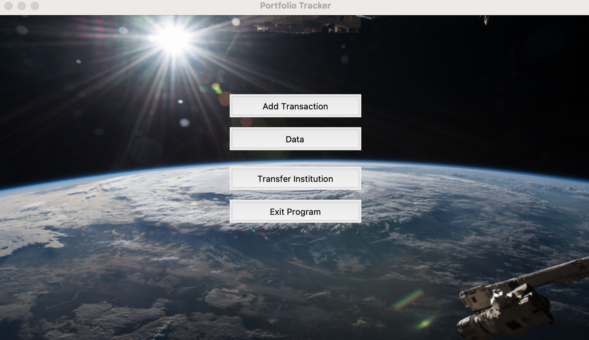
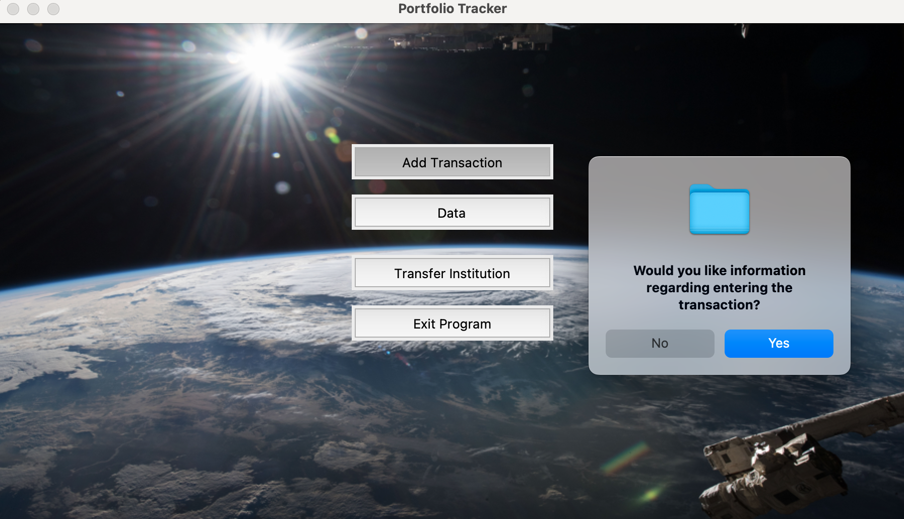
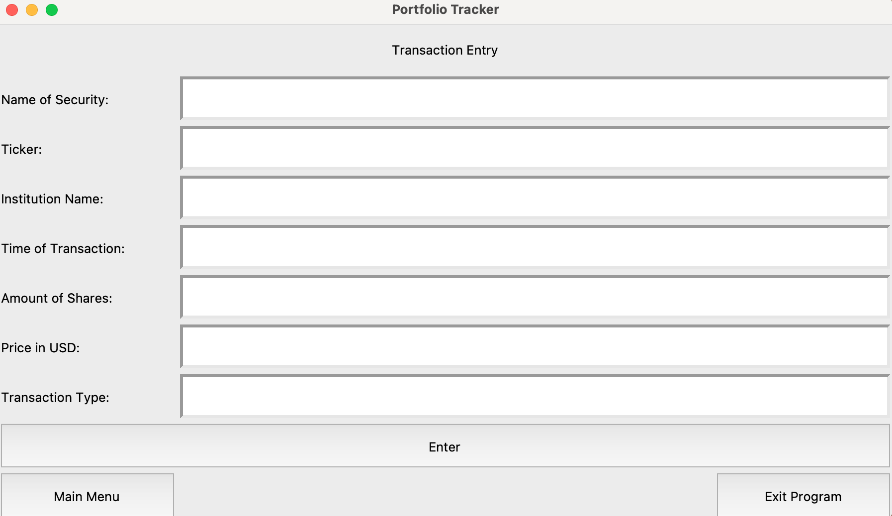
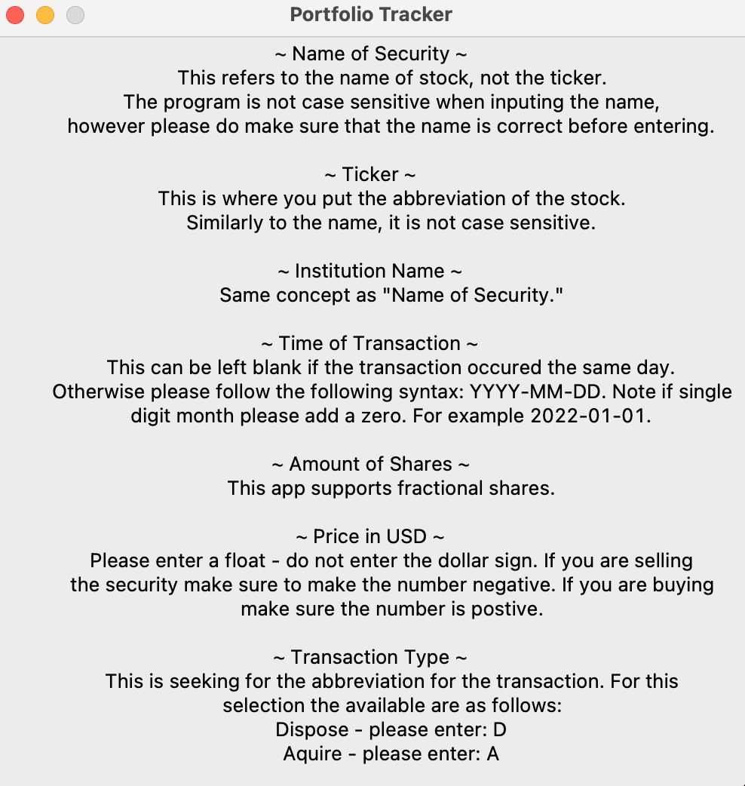
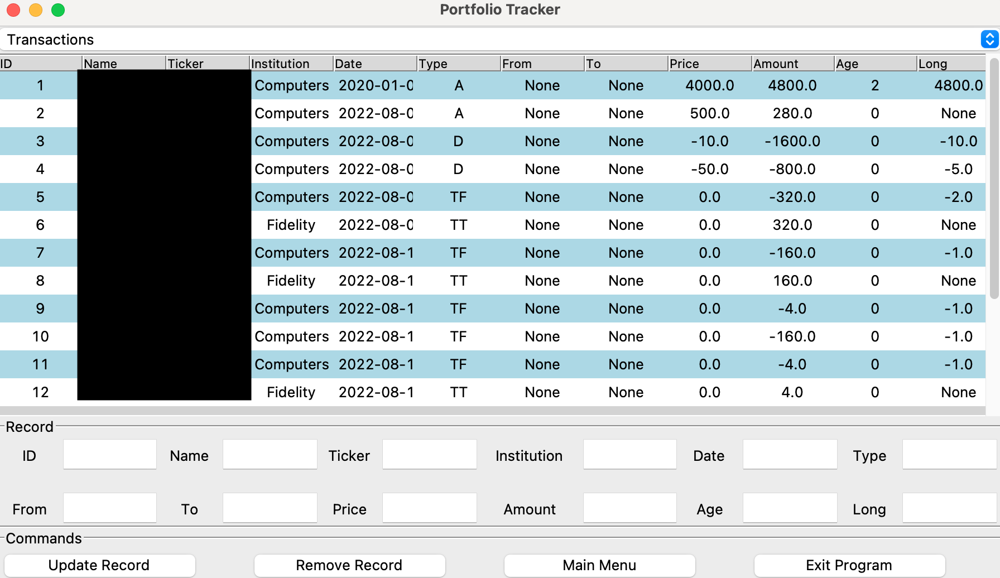
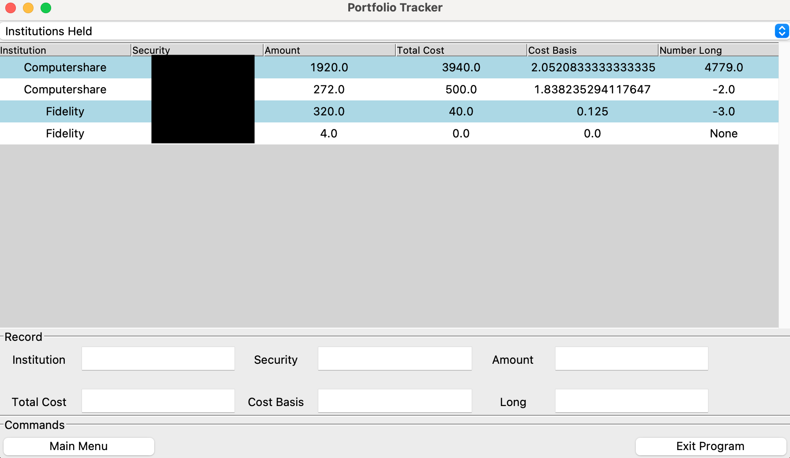
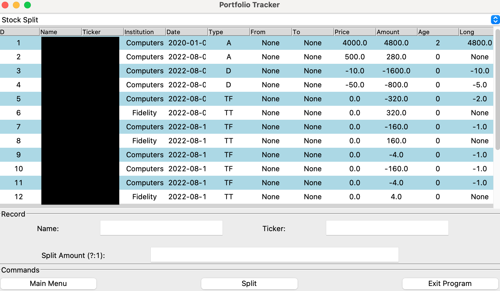

# Basic Portfolio Tracker
python (tkinter, re, pillow) | sqlite3

### Main Menu

To run: python3 main.py  
* If it does not work please check if you have all of the python packages installed.  

The data that you enter into the application will be stored locally on your device in a .db file.  
 
There are four options to choose from: "Add Transaction", "Data", "Transfer Institution", "Exit Program"

*  Add Transaction is where you add your security purchase or disposed of. Once clicked there will be a window that asks if you would like more information with regards to entry requirements.
*  Data is where you edit the Transactions table in the database. This functionality also provides the ability to see the Institution and securities held as well as your overall holdings for securities. In addition there is a option to convert the amount of shares owned according to a stock split. 
*  Transfer Insitution is where you input a transfer of an amount of a security from one institution to another. There are bugs associated with this method however. For example, the amount of shares held long (one year plus (due to tax differences from holding below one year)) can become negative because every transfer subtracts from the amount long despite the amount.
*  Exit program is to exit the program.

### Add Transaction

* Window that pops up when "Add Transaction" is clicked.  

   

* All entry boxes must be filled except for Date, which should only be left blank if the transaction happend today since it automatically sets the transaction as the current day.   
* If an institution is new, a window will pop up that will ask if you would like the institution. Similarly with the security. This serves as a check to prevent potential spelling errors that will pass off as a security that already exists. If there is an error this can be corrected in "Data" selection.
 
 

### Data

* Here you can update the record by selecting a record and changing the data in the entry boxes and then clicking the update record button.  
* If you want to delete the record instead, then click on the delete record button (only deletes one at a time).  
* TF means Transfered from, TT means Transfered To, A means acquired (bought), and D means disposed (sold).  

 

* The data here cannot be changed for the table Institutions held is dependent on the Transactions table for the information.  
 

* If there is ever a stock split for a particular stock you own, enter the split amount on the Split Amount (?:1) entry box. For example, if a stock is doing a 4:1 split (one stock splitting into 4 stocks) enter 4.

